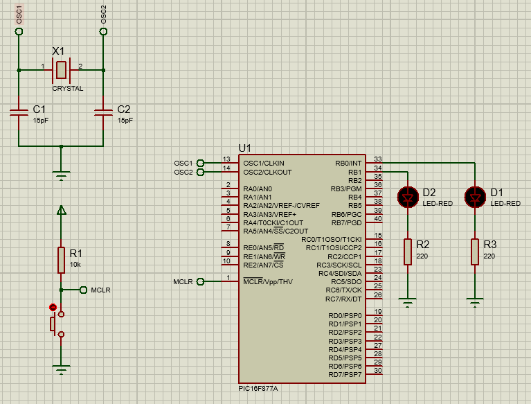

Diseñe e implemente un montaje con el microcontrolador PIC16F877A, que tenga dos leds conectados a 2 pines de uno de los puertos del PIC. Se desea que estos Leds se enciendan de manera intercalada a una frecuencia de oscilación de 1Hz.

