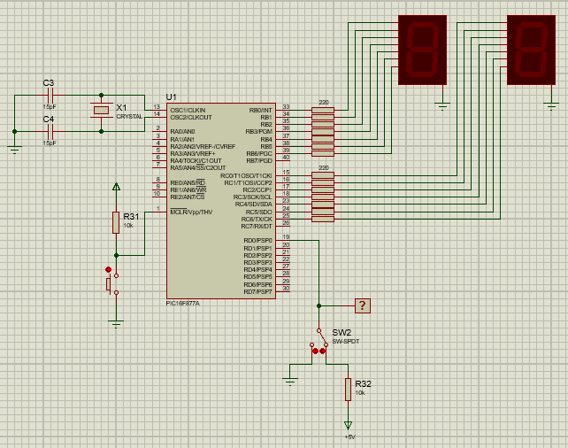

Con un PIC16F877A diseñe un contador bidireccional ascendente y descendete, el cual tendrá las siguientes
características: el conteo se mostrará en dos display de 7 segmentos conectados directamente a un par de puertos 
del micro. En otra línea adicional se debe conectar un Switch de dos posiciones conectado entre tierra y Vcc. Cuando este Switch esté conectado a tierra el contador hará la secuencia descendente y cuando el Switch esté en la posición de Vcc, el contador hará la secuencia de manera ascendente. Cada número debe mostrarse en los displays por un periodo de medio segundo.

