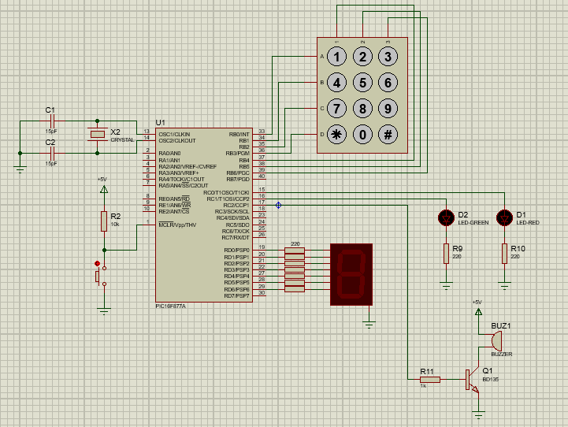

# P3-Cerradura electrónica
Diseñar una cerradura electrónica con el
microcontrolador PIC16F877A que tiene un código de entrada de cuatro dígitos programados
previamente (se puede tomar cuatro dígitos del carnet o de la cédula). Se debe conectar un
teclado matricial que tenga los números del 0 al 9 más los símbolos de * y # directamente en
el puerto B del microcontrolador (este puerto está diseñado expresamente para trabajar con
teclados de este tipo). Adicionalmente el montaje debe tener un display de 7 segmentos
conectado a cualquiera de los otros puertos del micro (el cual irá mostrando los números
ingresados) y un par de leds, uno de color verde y otro de color rojo, junto con un zumbador.
Estos componentes indicarán que la apertura de la puerta fue exitosa o hubo un error en la
clave de acceso; tanto el led verde como el rojo deben encender por un periodo de 2 segundos
para dar tiempo al usuario de abrir la puerta o para que escuche el zumbido y vuelva a
ingresar la clave.

La clave escogida fue: 0626
Sin embargo, puede ser cambiada por otra editando en el código.

Esta práctica se realizó tanto en ASSEMBLER como en XC8. 
El diseño con ASSEMBLER, la simulación presenta fallas al momento de
introducir la clave, pues no maneja muy bien el delay de antirebote de 250ms.
Cuando se presiona una tecla, el delay de antirebote no funciona correctamente y es posible
que dicha tecla se pulse dos veces seguidas, ocasionando que se detecte una clave errónea.
Por lo que hay que intentarlo varias veces. El circuito en físico no debería presentar esta falla
pues 250 ms de delay es suficiente tiempo.
Una posible solución a este problema en la simulación es colocar el delay de antirrebote a 1
segundo. Sin embargo, esto requiere introducir el código de manera lenta (esperando
aproximadamente 1 segundo entre cada pulsación de la tecla) para que se detecte de forma
correcta.
En cuanto a la simulación con XC8 (lenguaje C), ésta si funciona correctamente.

