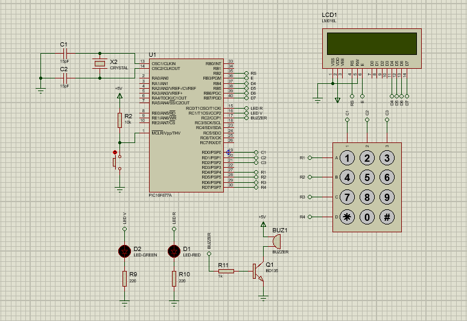

# P4-Cerradura electrónica 2.0
En la siguiente práctica de laboratorio se diseña una cerradura electrónica similar a la
implementada en la práctica anterior (P3), pero esta vez utilizando un display LCD en lugar
de un display de 7 segmentos para mostrar el código ingresado así como también algunos
mensajes adicionales como el nombre ficticio de una empresa, “Ingresar Pin”, “Pin Correcto”
y “Pin Incorrecto”.
Esta práctica fue realizada en C con el compilador XC8 de MPLAB.

